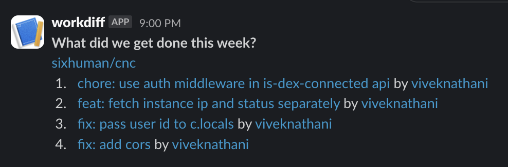

# workdiff

Generate changelogs from github commits and send them to slack, on a daily/weekly/monthly basis!

### add repositories

Repositories to be tracked are stored in [src/data/input.jsonl](./src/data/input.jsonl) file.

Each JSON line expects the following keys mandatorily:
1. `owner`: owner of the repository (typically a github user or a github organization)
2. `repo`: name of the repository
3. `branch`: branch to pick commits from
4. `interval`: cron expression to define your interval of fetching data and posting to slack
5. `since`: pick commits since when? acceptable values: `LAST_DAY` | `LAST_WEEK` | `LAST_MONTH`
6. `slackUrlKey`: The environment variable in which your slack webhook URL is stored.

Important => For every owner in the file, `workdiff` expects a corresponding environment variable, `GITHUB_TOKEN_${owner}`. This is your personal access token generated on github.

This file is checked into the codebase. Everytime you deploy the service, it will run a bootstrap operation that does the following:
1. Collect all tasks to run from the `jsonl` file.
2. Get rid of any old delayed tasks.
3. Schedule all the tasks.
4. Start the server!

You can view the scheduled tasks at: `/`.

### deployment

This project currently runs as a docker container on a cheap VPS. Feel free to fork this and run your own version!

### contributing

I am happy to accept pull requests. No hard rules.

### acknowledgements

created by Vivek Nathani ([@viveknathani_](https://twitter.com/viveknathani_)), licensed under the [MIT License](./LICENSE).
